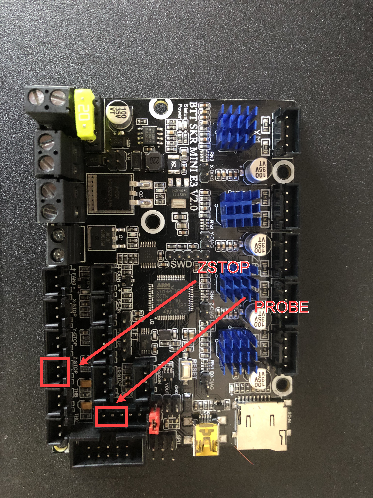
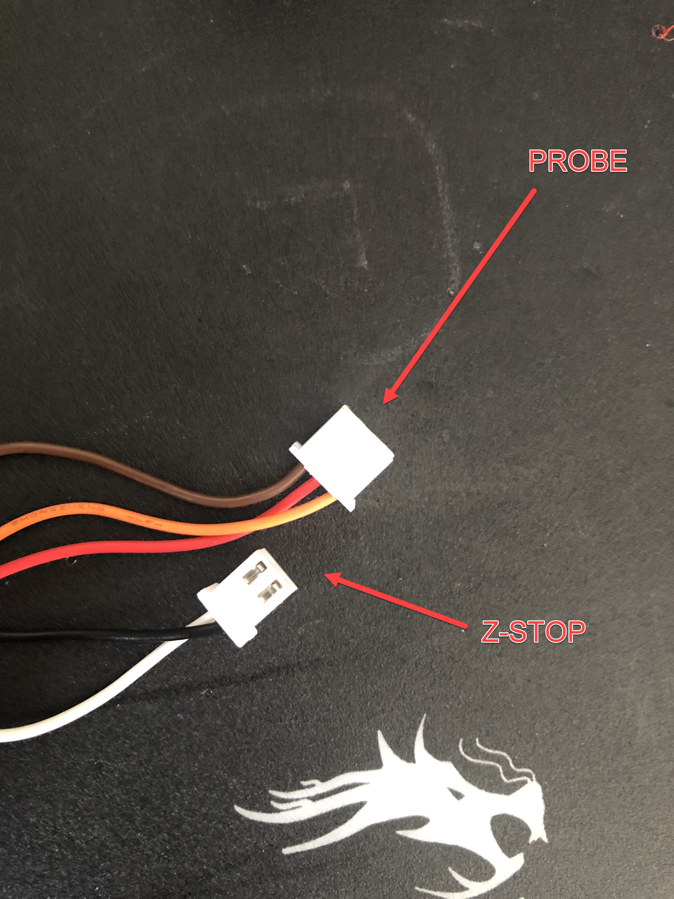
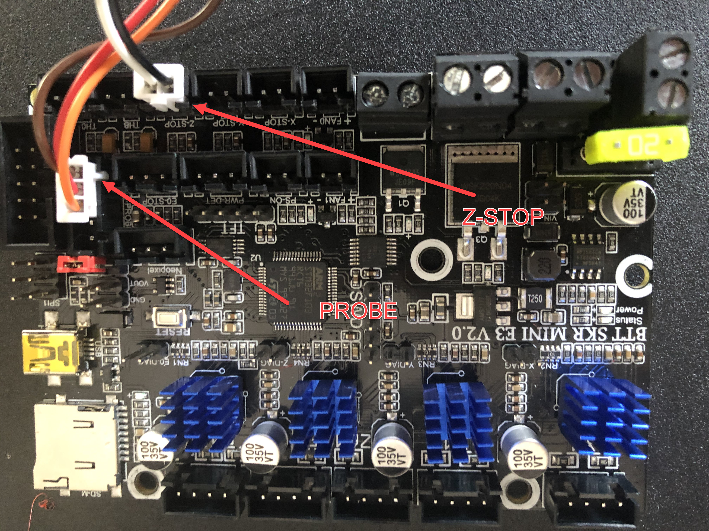
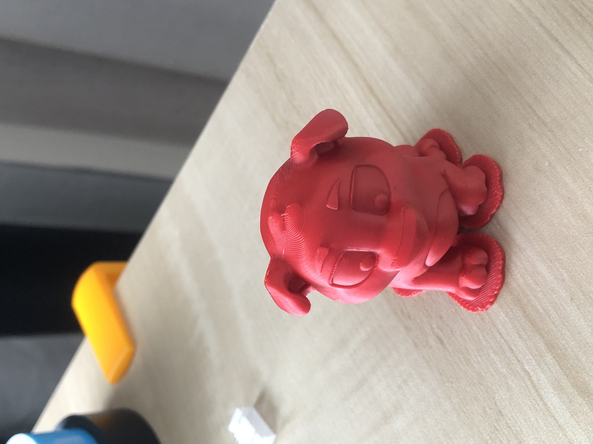
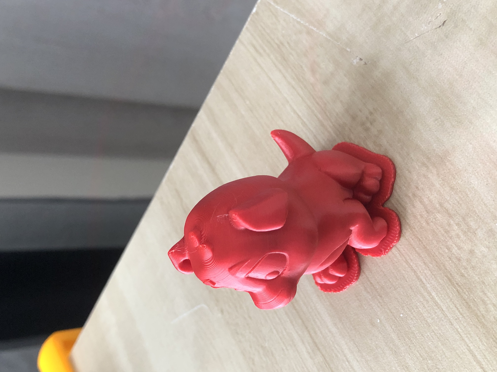
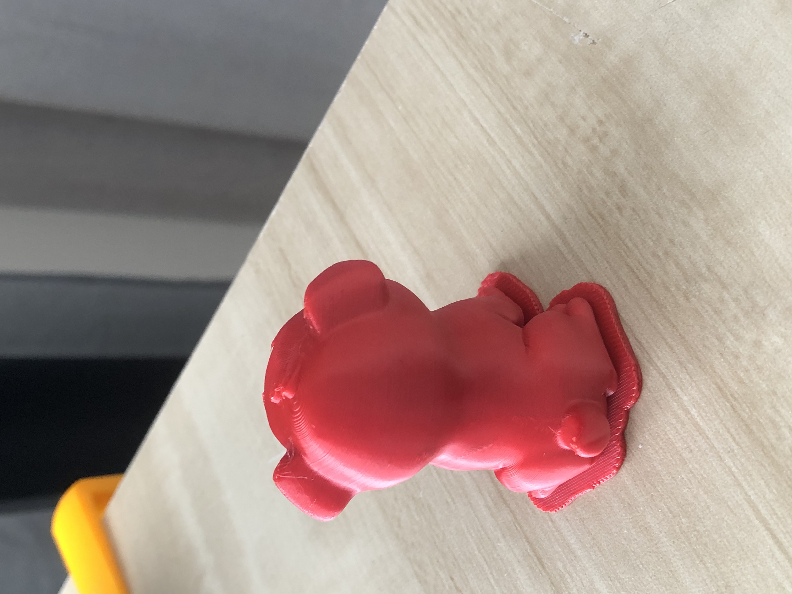
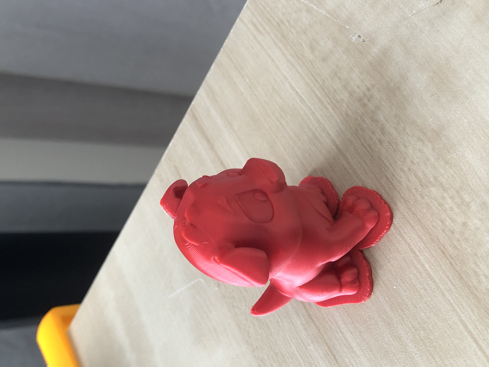

# First BLTouch Print

Date: 07-October-2020

  - [Wiring](#wiring)
  - [Results](#results)
  - [Resources](#resources)

## Wiring  

I used the Z-Homing approach and the wiring "diagram" I used, can be found [here](https://github.com/bigtreetech/BIGTREETECH-SKR-mini-E3/blob/master/hardware/BTT%20SKR%20MINI%20E3%20V2.0/Hardware/bltouch-2.0-2.jpg). I removed the dupont connections and instead used JST XH connectors as my control board uses these connectors. For the Firmware, I used the following YouTube Video ["BLTouch SKR E3 Mini V2"](http://www.youtube.com/watch?v=1NhAo3xR9HY), the presenter is French but you can work your way through it by following on-screen. The only thing to watch out for, is the inverting of the logic of your BLTouch. A genuine BLTouch should **NOT** need this.  

Based on the [SKR Mini E3 V2 Pinout](https://github.com/bigtreetech/BIGTREETECH-SKR-mini-E3/blob/master/hardware/BTT%20SKR%20MINI%20E3%20V2.0/Hardware/BTT%20SKR%20MINI%20E3%20V2.0-PIN.pdf) for Z-Homing I would need to split my connector from the "normal 5 pin" to "3-pin" (SERVO) and "2-pin" (STOP) connectors.

[Where to Connect on baord](pics/IMG_7236.jpg)  
  
[Split Probe Cable](pics/IMG_7237.jpg)  
  
[Final Connection on Board](pics/IMG_7238.jpg)  

## Results  

See below my wiring connection for a genuine BLTouch, mine is connected to a BigTreeTech SKR E3 Mini V2

Some pictures are below  
[pic1](pics/IMG_7229.jpg)  
  
[pic2](pics/IMG_7230.jpg)   
  
[pic3](pics/IMG_7231.jpg)  
  
[pic4](pics/IMG_7232.jpg)  
  

## Resources
[BLTouch SKR E3 Mini V2](http://www.youtube.com/watch?v=1NhAo3xR9HY)  
[Wiring Diagram](https://github.com/bigtreetech/BIGTREETECH-SKR-mini-E3/blob/master/hardware/BTT%20SKR%20MINI%20E3%20V2.0/Hardware/bltouch-2.0-2.jpg)   
[SKR Mini E3 V2 Pinout](https://github.com/bigtreetech/BIGTREETECH-SKR-mini-E3/blob/master/hardware/BTT%20SKR%20MINI%20E3%20V2.0/Hardware/BTT%20SKR%20MINI%20E3%20V2.0-PIN.pdf)